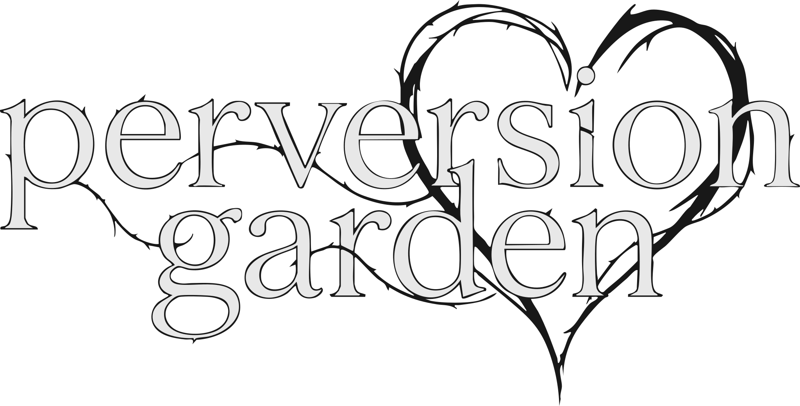
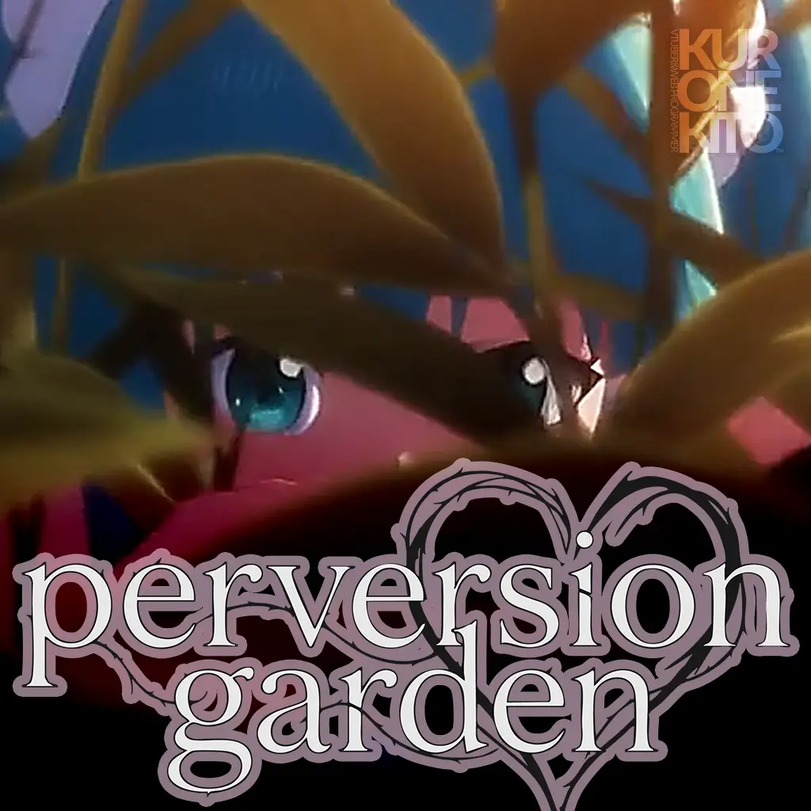
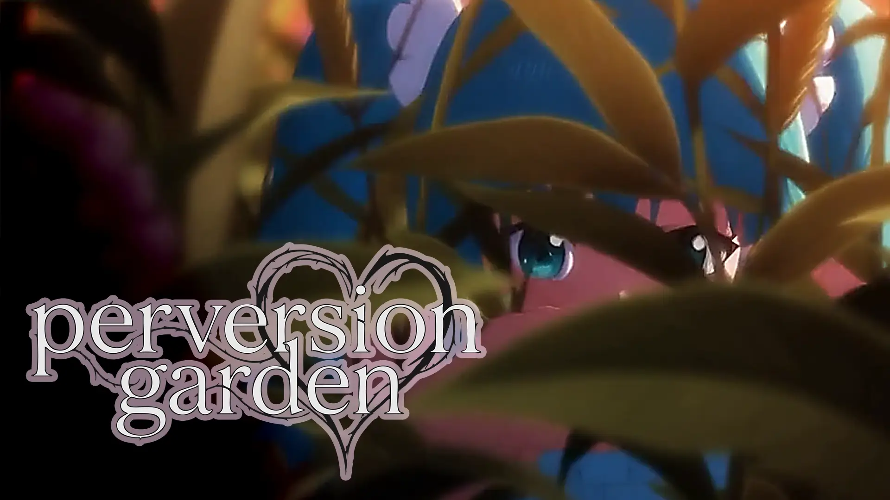
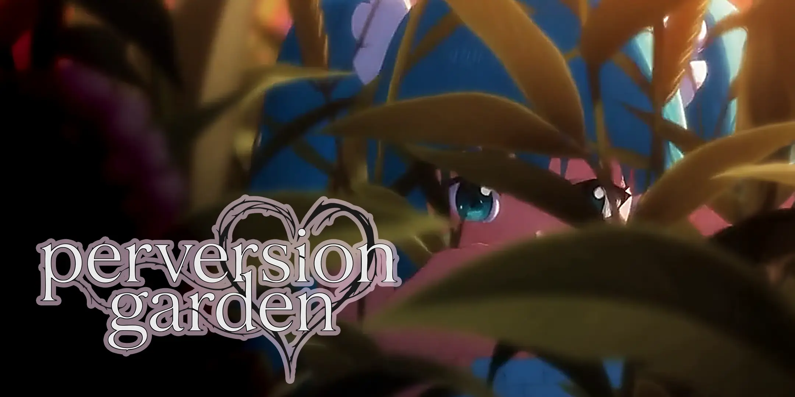

# 💿 [ボカロ曲 “perversion garden”](https://youtu.be/y0WLwU5n_A8) のリソース集

## 歌詞

- Thx [@Shota-Sakitsu](https://github.com/Shota-Sakitsu)
  - [Aegisub (`.ass`) 形式の歌詞ファイル](https://github.com/kurone-kito/perversion-garden/raw/main/texts/lyrics.ass)
  - [YouTube カラオケ風字幕 (`.ytt`) 形式の歌詞ファイル](https://github.com/kurone-kito/perversion-garden/raw/main/texts/lyrics.ytt)
- [SubViewer (`.sbv`) 形式の歌詞ファイル](https://github.com/kurone-kito/perversion-garden/raw/main/texts/lyrics.sbv)
- [SubRip (`.srt`) 形式の歌詞ファイル](https://github.com/kurone-kito/perversion-garden/raw/main/texts/lyrics.srt)

> 花びらひらり 闇に落ちる  
> キミは光 ボクは影  
> 震える指で 土を掬い  
> この手で<ruby><rb>種子</rb><rp>(</rp><rt>タネ</rt><rp>)</rp></ruby>を蒔いたのは ボクだった
>
> 凍えた夜に 吐いた願い  
> やがて芽吹く 小さな命  
> この<ruby><rb>箱庭</rb><rp>(</rp><rt>にわ</rt><rp>)</rp></ruby>だけが 全てなるように  
> 外の世界を閉ざしてしまった
>
> 赤い糸が絡みつく  
> 切りたくても切れない夢  
> 甘い毒を舐めるたび  
> キミは少しずつ ボクを包む
>
> 歪んだ<ruby><rb>箱庭</rb><rp>(</rp><rt>にわ</rt><rp>)</rp></ruby>で踊ろうよ  
> キミの笑顔が毒になる  
> ボクを養分に変えていく  
> それでもキミを 愛してる
>
> 枯れてもいい 捧げてもいい  
> キミが咲くなら それでいい。
>
> ---
>
> 心を刻む 木の枝たち  
> 優しい指で触れるたび  
> 痛みと共に 芽吹く花  
> 咲き乱れ やがて檻となる
>
> キミの影が 日を蔽い  
> 鳥も虫も 息潜める  
> それでもその<ruby><rb>箱庭</rb><rp>(</rp><rt>にわ</rt><rp>)</rp></ruby>は 息づいて  
> ボクを少しずつ 飲み込んでいく
>
> 涙の雨が降り注ぐ  
> 逃げ場のないこの楽園  
> 溶けた空気を吸い込み  
> キミと同じ色に染まる
>
> 歪んだ<ruby><rb>箱庭</rb><rp>(</rp><rt>にわ</rt><rp>)</rp></ruby>で踊ろうよ  
> キミの手がボクを裂いていく  
> 血の色染まるその世界で  
> それでもキミを 愛してる
>
> 枯れてもいい 消えてもいい  
> キミが生きるなら それでいい。
>
> ---
>
> 願った景色に 飲み込まれて  
> キミがすべてを染めていく  
> <ruby><rb>『愛』</rb><rp>(</rp><rt>AI</rt><rp>)</rp></ruby>と呼んだその法則が  
> ボクを土へ溶かしていく
>
> 歪んだ<ruby><rb>箱庭</rb><rp>(</rp><rt>にわ</rt><rp>)</rp></ruby>で踊ろうよ  
> キミの手がボクを裂いていく  
> 血の色染まるその世界で  
> それでもキミを 愛してる
>
> 歪んだ<ruby><rb>箱庭</rb><rp>(</rp><rt>にわ</rt><rp>)</rp></ruby>で眠ろうよ  
> キミの呼吸が風になる  
> ボクの全てを吸い尽くして  
> キミの中で 終わりたい

## 楽曲関係

### perversion garden の音楽データ

ぜひ、あなたのスマホのボカロプレイリストへ！

- 88MB: [【ロスレス】Apple Lossless (ALAC M4A)](https://github.com/kurone-kito/perversion-garden/raw/refs/heads/main/musics/perversion_garden.alac.m4a)
- 62MB: [【ロスレス】Free Lossless Audio Codec (FLAC)](https://github.com/kurone-kito/perversion-garden/raw/refs/heads/main/musics/perversion_garden.flac)
- 12MB: [MPEG Audio layer-3 (MP3)](https://github.com/kurone-kito/perversion-garden/raw/refs/heads/main/musics/perversion_garden.mp3)

### Instrumental (カラオケ)

歌みた向けのボカロなし版です。

- 88MB: [【ロスレス】Apple Lossless (ALAC M4A)](https://github.com/kurone-kito/perversion-garden/raw/refs/heads/main/musics/instrument.alac.m4a)
- 61MB: [【ロスレス】Free Lossless Audio Codec (FLAC)](https://github.com/kurone-kito/perversion-garden/raw/refs/heads/main/musics/instrument.flac)
- 12MB: [MPEG Audio layer-3 (MP3)](https://github.com/kurone-kito/perversion-garden/raw/refs/heads/main/musics/instrument.mp3)

### Vocals (アカペラ)

歌みた向けのボカロだけ版です。

#### メインボーカル

- 74MB: [【ロスレス】Apple Lossless (ALAC M4A)](https://github.com/kurone-kito/perversion-garden/raw/refs/heads/main/musics/vocals_main.alac.m4a)
- 40MB: [【ロスレス】Free Lossless Audio Codec (FLAC)](https://github.com/kurone-kito/perversion-garden/raw/refs/heads/main/musics/vocals_main.flac)
- 12MB: [MPEG Audio layer-3 (MP3)](https://github.com/kurone-kito/perversion-garden/raw/refs/heads/main/musics/vocals_main.mp3)

#### バックボーカル

- 70MB: [【ロスレス】Apple Lossless (ALAC M4A)](https://github.com/kurone-kito/perversion-garden/raw/refs/heads/main/musics/vocals_sub.alac.m4a)
- 34MB: [【ロスレス】Free Lossless Audio Codec (FLAC)](https://github.com/kurone-kito/perversion-garden/raw/refs/heads/main/musics/vocals_sub.flac)
- 12MB: [MPEG Audio layer-3 (MP3)](https://github.com/kurone-kito/perversion-garden/raw/refs/heads/main/musics/vocals_sub.mp3)

## 画像関係

### ロゴ

|                                                  SVG                                                   |                                                   PNG                                                    |
| :----------------------------------------------------------------------------------------------------: | :------------------------------------------------------------------------------------------------------: |
|  |  |

### ジャケット

|                                                        1:1                                                         |                                                          16:9                                                            |
| :----------------------------------------------------------------------------------------------------------------: | :----------------------------------------------------------------------------------------------------------------------: |
|  |  |

|                                                      2:1                                                        |
| :-------------------------------------------------------------------------------------------------------------: |
|  |

### 黒音キトのロゴ

必要に応じてご利用ください。(必須ではありません)

## トリビア

- この曲は
  [pixiv 連載小説 “白のハート〜95日で終わるミクマス物語”](https://www.pixiv.net/novel/series/14283028)
  のテーマソングです。
  本作をご覧いただくと、MV 中のあの男誰？と言う疑問が解消できるでしょう。  
  勿論知らなくても、オリジナルのストーリーとして楽しめます。
- 男の持っているスマートフォンは iPhone Xs Max で、動いているアプリは
  [Medly](https://medlylabs.com) と YouTube です。
  - 余談ですが、この曲のインストは Medly で制作して、Logic Pro
    で MIX しました。
- 黒音キトは他にも楽曲制作をしていますので、
  [YouTube のプレイリストも併せてご覧ください！](https://www.youtube.com/playlist?list=PLSIkKh7ywTyhLedFMDxA3IUz2_X0qdNDf)

<strong>【ネタバレ要素あり注意】</strong>タップで表示

- 登場する男は、スポーンした初音ミクのマスターです。
- この曲は勿論私、黒音キトが制作したものですが、
  それと同時にマスターが制作した曲でもあります。
- 草に塗れて動けなくなったマスターは、シンセサイザーや iMac
  にもう手が届かないと悟り、ポケットからスマホを取り出して Medly
  でこの曲の残りを完成させ、アップロードまで完了した、という設定です。

<strong>【特級ネタバレ注意‼️】</strong>タップで表示

- 実は、MV 中の初音ミクはこの曲を **歌っていません。**
- この MV には 2 人の初音ミクがいます。
  - 1 人は MV に登場する、アンドロイドとして自律的に思考行動する初音ミク。
  - もう 1 人は、マスターが制作した曲を歌う、VOCALOID としての初音ミク。
- マスターは、純真無垢な初音ミクに倒錯的な愛を覚え、誤った教育を施した結果、
  初音ミクはマスターを捕食(比喩)する怪物へと育ってしまいました。
- つまり、MV 中の初音ミクはマスターにとっての
  **“<ruby><rb>倒錯の箱庭</rb><rp>(</rp><rt>perversion garden</rt><rp>)</rp></ruby>”**
  の象徴であり、この曲を歌う初音ミクとは別個の存在なのです。
- 自身の末路を悟ったマスターが彼女に黙って、こっそり制作したのがこの曲です。
  そして、この曲の最初の視聴者こそ、MV 中に登場した初音ミクなのです。
  つまり、VOCALOID としての初音ミクは、マスターから MV 中の初音ミクへの、
  メッセンジャーの役割も担っているのです。
- この先は 11 月 27 日公開予定の、
  [白のハート 45 話](https://www.pixiv.net/novel/series/14283028)
  で明かされるでしょう。

## ライセンス

ここにあるコンテンツは全て、
[CC-BY-4.0](https://creativecommons.org/licenses/by/4.0/deed.ja)
ライセンスの下で提供しております。

出典の明記のみお守りいただければ、無制限のご利用がいただけます。
